# 🌱 Biomation

> **Cultivate Data, Nourish Growth.**

Biomation is an agriculture IoT platform designed to help users monitor,
analyze, and manage agricultural environments through connected devices
and collected sensor data.

This repository contains selected parts of the Biomation project as a
public showcase of my frontend development and software engineering work.

> **Note:** The complete Biomation source code is kept private. This
> repository contains selected frontend components and documentation for
> demonstration and portfolio purposes.

---

## 📌 Overview

Biomation combines IoT devices, data collection, visualization, and
management tools into a single platform for agricultural monitoring.

The platform is designed around several key areas:

- 📊 Data analysis and visualization
- 📡 IoT device management
- 🔐 User and environment security
- 📝 Activity and system logs
- 👤 User authentication

The goal is to provide users with a centralized interface for monitoring
agricultural environments and making better decisions from collected data.

---

## 👨‍💻 My Contribution

I designed and developed the Biomation platform, including its frontend
architecture, user interface, authentication flow, dashboard interfaces,
and interaction logic.

Some of the areas I worked on include:

- Designing responsive interfaces
- Building reusable React components
- Implementing authentication flows
- Handling client-side validation
- Integrating frontend applications with APIs
- Implementing loading and error states
- Building data visualization interfaces
- Designing IoT device management interfaces
- Implementing user and environment security interfaces
- Creating interactive dashboard components

The complete project contains additional backend and infrastructure
components that are not included in this public repository.

---

## 🔐 Authentication

Biomation includes a custom authentication flow for account registration
and user login.

### Login

The login interface includes:

- Email validation
- Password validation
- Google reCAPTCHA verification
- Authentication API integration
- Authentication state checking
- Error handling
- Loading states
- Password reset functionality
- Redirecting authenticated users to the dashboard

### Signup

The signup interface includes:

- Email validation
- Username validation
- User tag validation
- Password requirement validation
- Google reCAPTCHA verification
- Duplicate email detection
- Duplicate username/tag detection
- Error handling
- Loading states
- Successful registration feedback

Selected authentication source code can be found in:

```text
login/
└── login.jsx

signup/
└── signup.jsx
```

### Authentication Flow

The general authentication flow is:

```text
User
 │
 ▼
Login / Signup Form
 │
 ▼
Client-side Validation
 │
 ▼
reCAPTCHA Verification
 │
 ▼
Authentication API
 │
 ▼
Server-side Validation
 │
 ▼
Authentication / Account Creation
 │
 ▼
Dashboard
```

The server-side authentication implementation is kept private.

---

## 🖼️ Screenshots

### Login

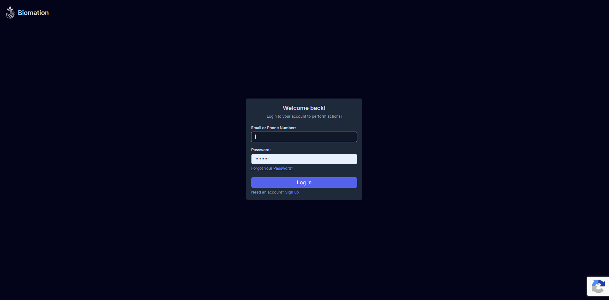

### Signup

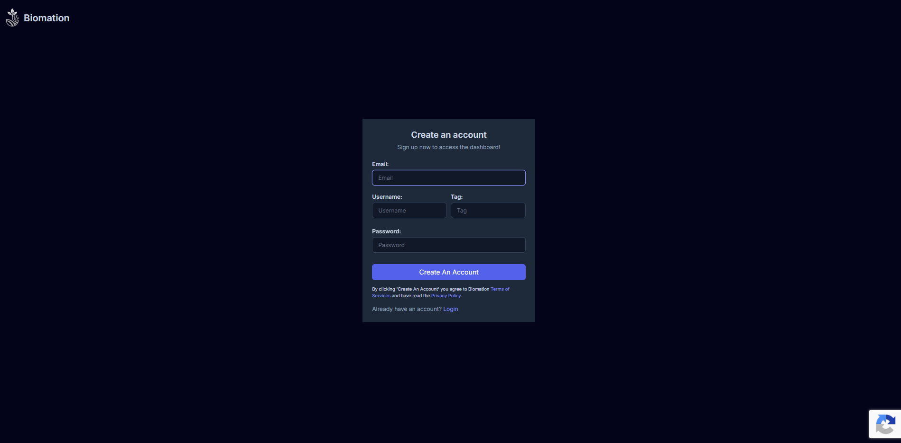

### Login Error Handling

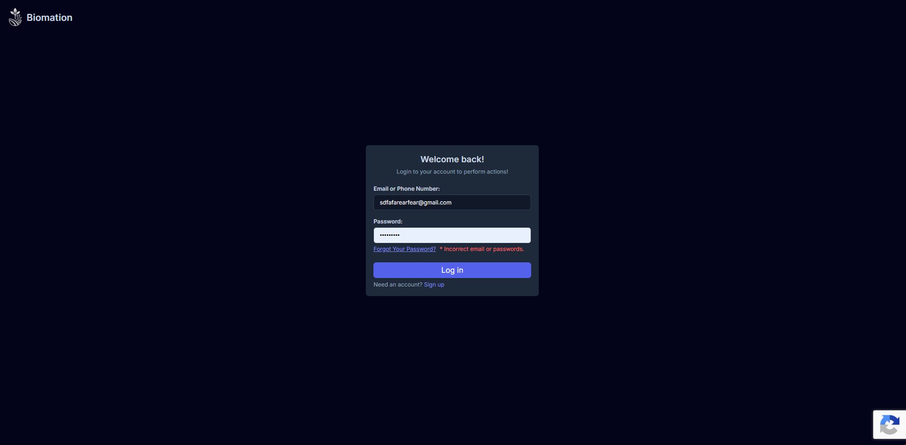

### Signup Error Handling

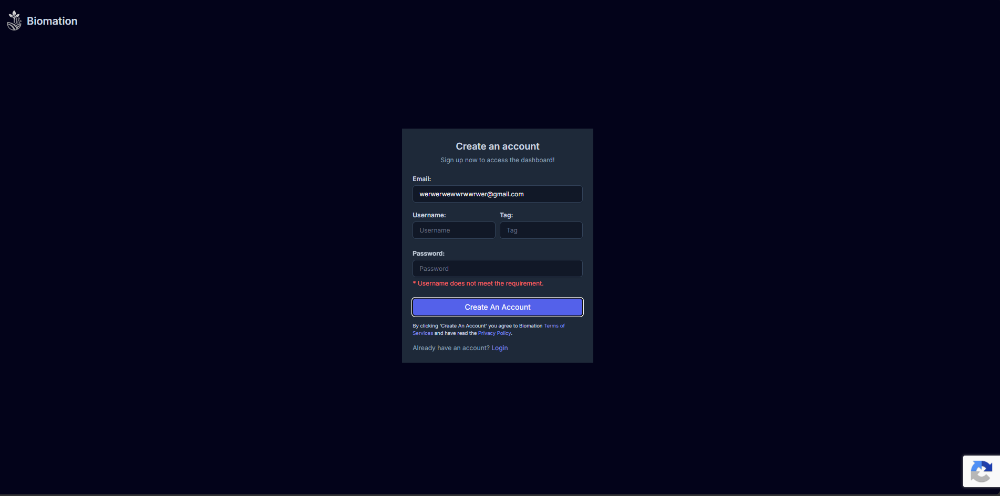

---

## 🛠️ Technologies

### Frontend

* React
* JavaScript
* React Router
* React Query
* Tailwind CSS
* GSAP

### Authentication & Security

* Google reCAPTCHA
* Token-based authentication
* Client-side validation
* Server-side validation

### Internationalization

* i18next
* react-i18next

### Data & Backend

The complete Biomation project also includes backend services,
database integration, APIs, and IoT-related components.

These parts are not included in this public showcase repository.

---

## 📂 Repository Structure

```text
Biomation-showcase/
│
├── README.md
│
├── login/
│   └── login.jsx
│
├── signup/
│   └── signup.jsx
│
└── screenshots/
    ├── login.png
    ├── signup.png
    ├── login-error.png
    └── signup-error.png
```

---

## 📊 Dashboard

> **This section will be documented separately.**

The Biomation dashboard contains several major modules for managing and
analyzing agricultural IoT data.

### Modules

* Analysis
* Devices
* Security
* Logs

---

## 📟 Devices

The **Devices module** provides a hierarchical system for managing agricultural IoT devices. Users can organize devices into **clients, directories, and sub-directories**, making it easier to manage devices across different organizations, workplaces, or environments.

Devices and directories can also be dragged into the **Inventory system** for use in other modules such as Analysis, Logs, and Security.

### ✨ Features

* 📱 Store and manage IoT devices
* 🏢 Create and manage clients
* 📁 Create directories and sub-directories
* 🔗 Register devices to specific environments
* 🗂️ Organize devices using hierarchical structures
* 📤 Export device data as JSON
* 🖱️ Drag-and-drop device management

### 🔄 Workflow

A typical device management workflow:

```text
Register a device
       ↓
Assign the device to a client
       ↓
Create a directory
(e.g. North East)
       ↓
Move the device into the directory
       ↓
Create sub-directories if needed
       ↓
Drag the required resource
into the Inventory
```

The **Inventory** acts as a temporary workspace where users can select clients, directories, sub-directories, or devices and use them across other modules.

### 🛠️ Technical Highlights

* Hierarchical resource management
* Reusable React components
* Drag-and-drop interactions
* Device registration and management
* API integration
* Client-side state management
* Dynamic data rendering

### 📸 Screenshots

#### Client & Device Registration

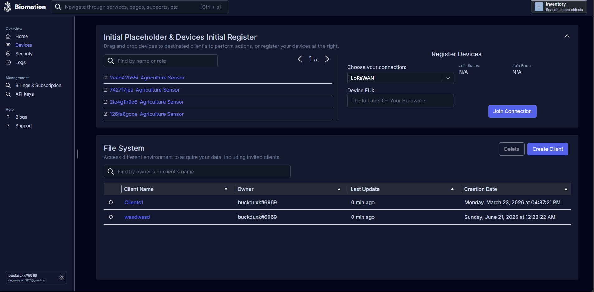

#### Directory Management

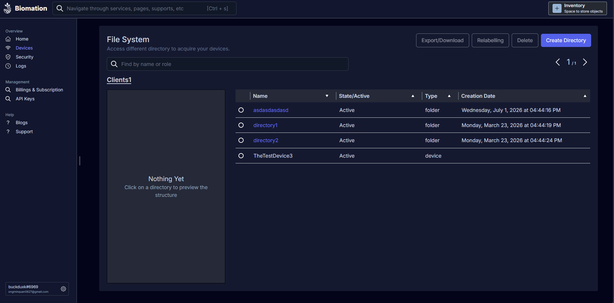

> Sub-directories use the same hierarchical structure as directories.

#### Device Management

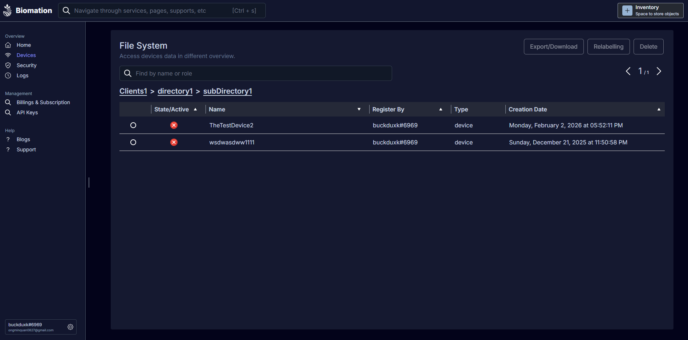

#### Dragging Resources to Inventory

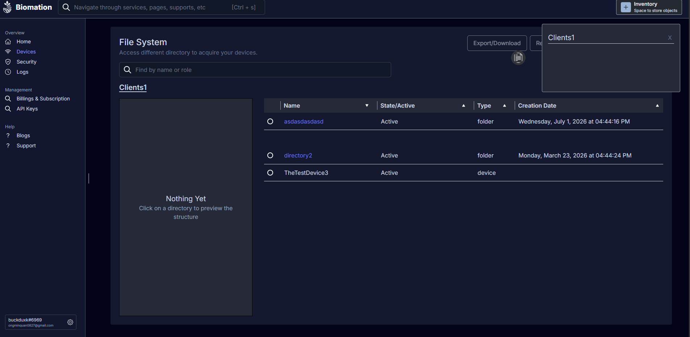

---

## 📝 Logs

The **Logs module** allows users to monitor system activity through device logs and user activity logs.

It provides filtering and metadata inspection tools to help users identify specific events and track activity within their environment.

### ✨ Features

* 🔎 Filter logs by date, status, and other criteria
* 📊 View device metadata
* 📱 Monitor device activity
* 👤 Monitor user activity
* 🏷️ Categorize different types of events
* ⚠️ Display errors and system status

### 🔄 Workflow

A typical workflow:

```text
Select a client from the Inventory
             ↓
Open the Logs module
             ↓
Filter logs using
date range, status, etc.
             ↓
Inspect the targeted event
             ↓
View detailed metadata
```

### 🛠️ Technical Highlights

* Activity and event tracking
* Structured log data
* Log filtering and search
* Event categorization
* Dynamic data rendering
* Error and status handling
* Reusable log components
* API integration

### 📸 Screenshots

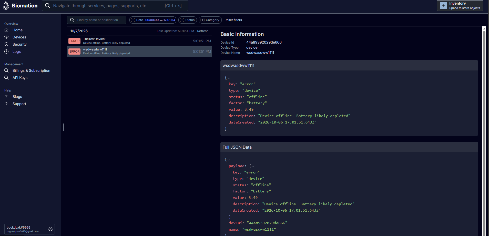

---

## 🔐 Security

The **Security module** provides tools for managing users, roles, permissions, and security-related information within a client environment.

Client owners can invite users, create and modify roles, assign permissions, and inspect security metrics associated with users.

### ✨ Features

* 👥 Invite users
* 🔑 Create and modify roles
* 🛡️ Assign permissions
* 📊 Monitor user security metrics
* 👤 Inspect user metadata
* 🏢 View client security metadata
* 🔐 Monitor 2FA status

### 🔄 Workflow

A typical security management workflow:

```text
Select a client from the Inventory
             ↓
Invite users when required
             ↓
Create or modify roles
             ↓
Assign roles and permissions
             ↓
Inspect user security metrics
             ↓
Monitor security status
```

This allows client owners to control access while monitoring the security status of users within their environment.

### 🛠️ Technical Highlights

* Layered security architecture
* Hierarchical access management
* Role and permission monitoring
* User security inspection
* 2FA status monitoring
* Interactive security drill-down
* Security metrics and status indicators
* Dynamic data-driven interface

### 📸 Screenshots

#### User Security Dashboard

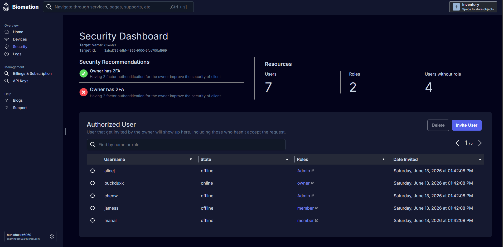

#### Role Dashboard & User Metadata

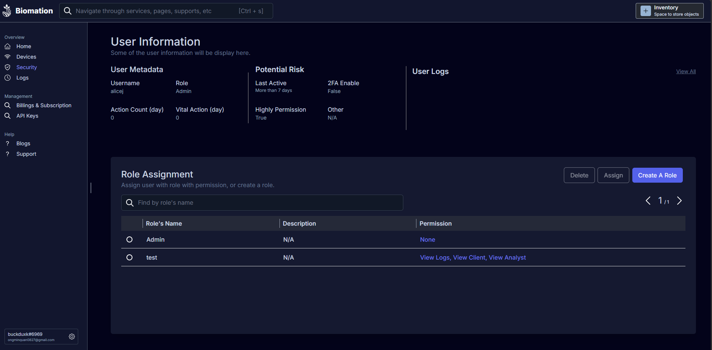

#### Role Creation & Modification

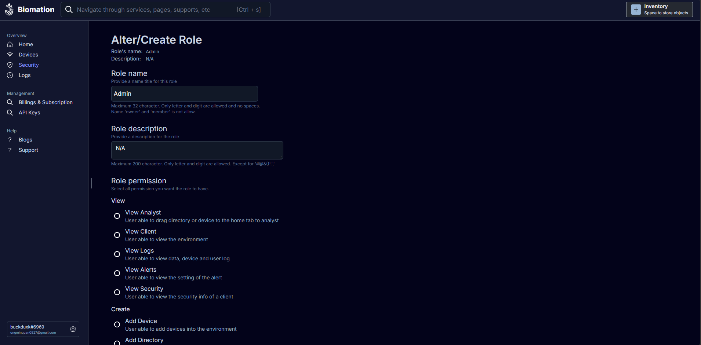

---

## 📈 Analysis

The **Analysis module** allows users to monitor and compare agricultural sensor data across different devices and time periods.

Users can select specific devices, metrics, and date ranges to visualize changes in their agricultural environment through interactive charts.

### ✨ Features

* 📅 Date and time range selection
* 🔀 Device and resource comparison
* 📊 Sensor metric selection
* 📡 Live sensor data
* 📈 Interactive data visualization
* 🌦️ Weather information
* 🗂️ Multiple analysis workspaces
* 🔄 Real-time data updates

### 🔄 Workflow

A typical analysis workflow:

```text
Drag a device or directory
from the Inventory
          ↓
Select a date range
          ↓
Select a metric
(e.g. Temperature)
          ↓
Compare sensor data
          ↓
Analyze the visualization
```

Users can compare measurements between different devices or time periods to identify changes in environmental conditions.

### 🛠️ Technical Highlights

* React-based dashboard architecture
* Reusable dashboard components
* API-based data retrieval
* WebSocket-based real-time data
* Interactive data visualization
* Client-side state management
* Loading and error handling
* Responsive interface

### 📸 Screenshots

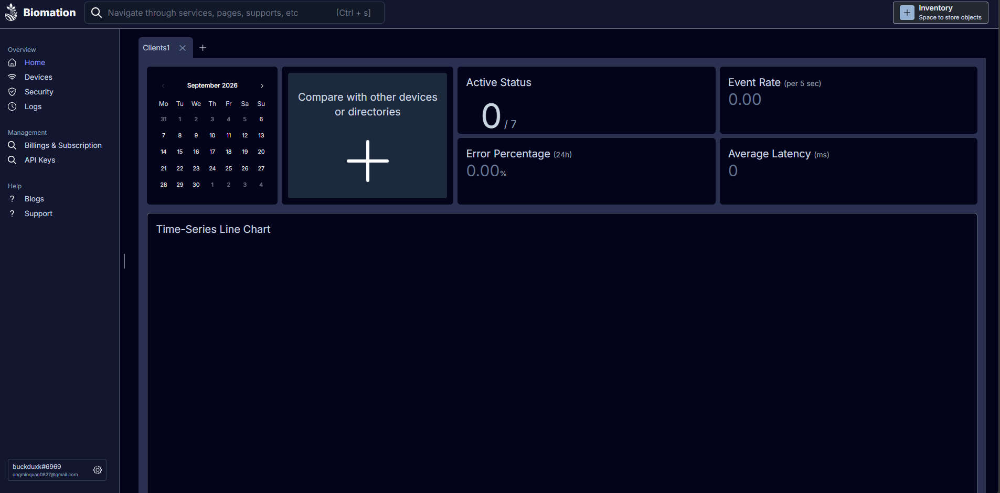

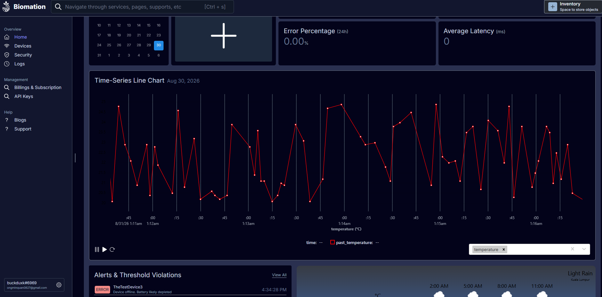

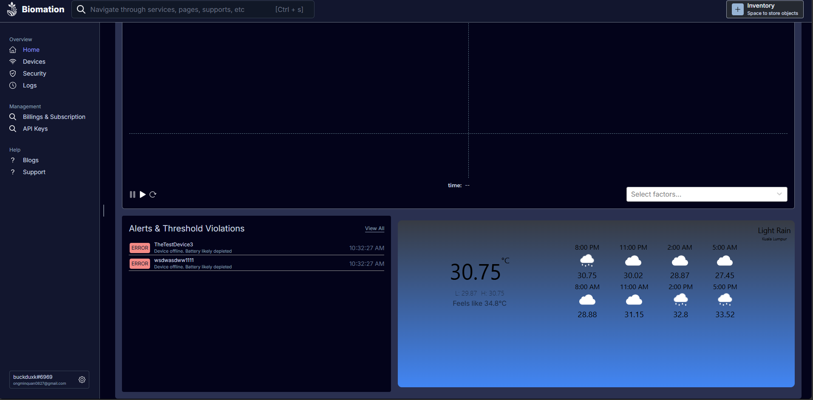

---

## 🔒 Source Code & Privacy

The complete Biomation project is not publicly available because it
contains private application logic and backend implementation.

This repository intentionally contains only selected parts of the project
that demonstrate my development work.

The public showcase does **not** include:

* Backend source code
* Database implementation
* Authentication server implementation
* Private infrastructure
* Environment variables
* API credentials or secrets
* Internal application configuration

---

## 🎯 Project Goals

Biomation was built as a project to explore the development of an
agriculture-focused IoT platform while combining frontend development,
backend systems, data visualization, and connected-device concepts.

The project also serves as an opportunity to experiment with building
larger-scale application architecture rather than isolated components.

---

## 📜 License

This repository is a public showcase of the Biomation project.

The source code provided here may not represent the complete private
Biomation codebase.


# Personal Portfolio

A personal portfolio website built to showcase my projects, technical skills, learning journey, and experience as I grow as a developer.

🌐 **Live Website:** Not yet deploy

---

## ✨ Features

* Responsive portfolio website
* Animated landing page
* Introduction / about section
* Project showcase
* Interactive project technology section
* Contact section
* Smooth scrolling and scroll-based animations
* Responsive design for different screen sizes

---

## 🛠️ Tech Stack

### Frontend

* **React** — UI development
* **TypeScript** — Type-safe JavaScript
* **Vite** — Development environment and build tool
* **Tailwind CSS** — Styling
* **GSAP** — Animations and scroll interactions

### Tools

* **Git & GitHub** — Version control
* **ESLint** — Code quality
* **npm** — Package management

---

## 📂 Project Structure

```text
portfolio/
├── public/
│   └── ...
│
├── src/
│   ├── assets/
│   ├── components/
│   ├── layouts/
│   ├── pages/
│   ├── styles/
│   ├── App.tsx
│   └── main.tsx
│
├── .gitignore
├── eslint.config.js
├── index.html
├── package.json
├── tsconfig.json
├── vite.config.ts
└── README.md
```

---

## 🚀 Getting Started

### 1. Clone the repository

```bash
git clone git@github.com:pleasetypeyourusername/Portfolio.git
cd portfolio
```

### 2. Install dependencies

```bash
npm install
```

### 3. Start the development server

```bash
npm run dev
```

The development server will start locally. Open the URL provided in the terminal to view the website.

---

## 🏗️ Build for Production

Create a production build with:

```bash
npm run build
```

To preview the production build locally:

```bash
npm run preview
```

---

## 📌 Projects

Some of the projects showcased in this portfolio include:

### Biomation

An agriculture IoT platform concept focused on collecting and visualizing farm data through connected sensors.

**Technologies:**

* React
* Tailwind CSS
* GSAP
* Kafka
* Vite
* Node.js 
* Javascript
* Docker 
* Kubernete 
* Linux


### Personal Portfolio

This portfolio itself is also a project, built to experiment with modern frontend technologies, animations, responsive design, and interactive UI.

---

## 📚 What I Learned

This project helped me improve my understanding of:

* React component architecture
* TypeScript
* Tailwind CSS
* GSAP animations
* Responsive web design
* Scroll-based interactions
* Project organization
* Git and GitHub workflows
* Building and deploying a frontend application

---

## 📬 Contact

If you'd like to get in touch, you can reach me through the contact information provided (prefer Instagram).

**GitHub:** https://github.com/pleasetypeyourusername

**Linked:** https://www.linkedin.com/in/buck-duck-46254b213

**Instagram:** https://www.instagram.com/pleasetypeyourusername

**Gmail:** https://mail.google.com/mail/?view=cm&to=ongminquan0827@gmail.com

---

## 📄 License
